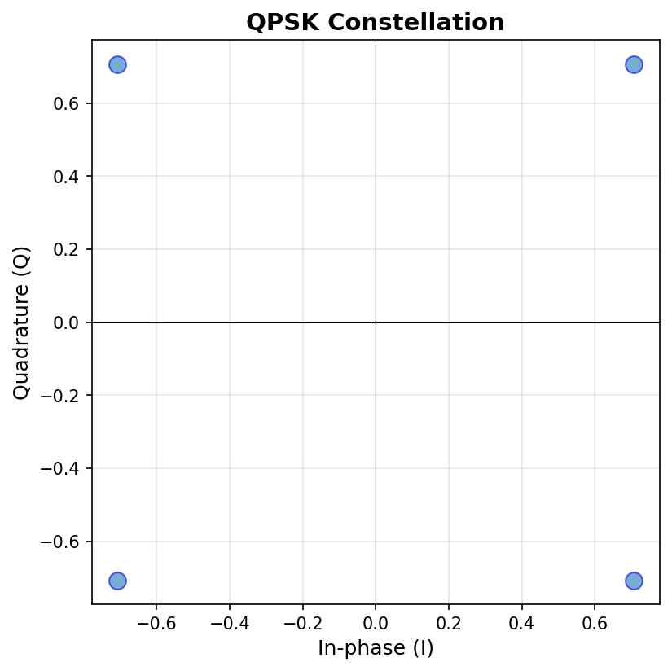
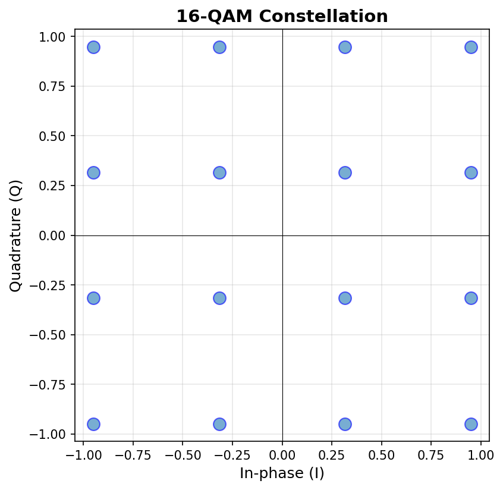
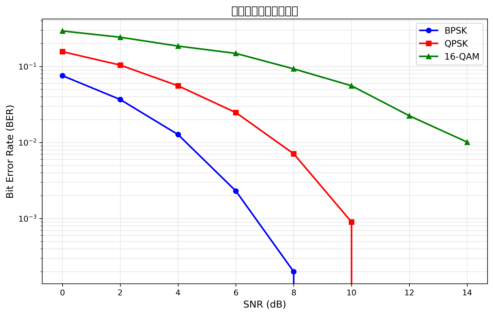

# 数字调制解调实验报告

**实验名称**：数字调制解调实验  
**学生姓名**：孙浩然  
**学号**：2022280450  
**实验日期**：2026年4月23日  
**提交日期**：2026年4月23日  

---

## 1. 实验目的

本实验围绕数字通信中的典型数字调制与解调技术展开，主要目的是通过 Python 编程实现 BPSK、QPSK 和 16-QAM 三种常见数字调制方式，并通过星座图和误码率曲线验证其基本通信性能。具体目标如下：

1. 理解数字调制的基本思想，掌握比特序列到复数基带符号的映射方法。
2. 掌握 BPSK、QPSK、16-QAM 三种调制方式的星座图结构及其物理含义。
3. 使用 NumPy 实现数字调制、解调和误码率计算。
4. 使用 Matplotlib 绘制星座图和 BER 性能曲线。
5. 通过 AWGN 信道仿真，分析不同调制方式在不同信噪比下的误码性能。
6. 熟悉 GitHub Pull Request 提交流程和自动评分测试流程。
7. 体验 GitHub Copilot/ChatGPT 等 AI 编程助手在代码实现、调试和实验分析中的辅助作用。

---

## 2. 实验原理

### 2.1 BPSK 调制原理

BPSK（Binary Phase Shift Keying，二进制相移键控）是一种最基本的相移键控方式。每个符号只携带 1 bit 信息，通过两个相位相差 180° 的载波状态表示二进制 0 和 1。

在本实验中，BPSK 的映射关系为：

$$
s =
\begin{cases}
+1, & b = 0 \\
-1, & b = 1
\end{cases}
$$

也可以写成向量化表达式：

$$
s = 1 - 2b
$$

其中，$b \in \{0,1\}$，$s$ 为调制后的符号。BPSK 的星座图只有两个点，分别位于实轴上的 $+1$ 和 $-1$，虚部为 0。

BPSK 的优点是实现简单、星座点间距较大、抗噪声性能较好；缺点是每个符号只能传输 1 bit，频谱效率较低。

### 2.2 QPSK 调制原理

QPSK（Quadrature Phase Shift Keying，四相相移键控）每个符号携带 2 bit 信息。它将两个比特组成一组，并映射到复平面上的四个星座点。与 BPSK 相比，QPSK 在相同符号率下可以传输两倍的信息量。

本实验采用格雷码映射，映射关系如下：

| 输入比特 | 调制符号 |
|---|---|
| 00 | $(1+j)/\sqrt{2}$ |
| 01 | $(-1+j)/\sqrt{2}$ |
| 11 | $(-1-j)/\sqrt{2}$ |
| 10 | $(1-j)/\sqrt{2}$ |

四个星座点分别位于第一、第二、第三、第四象限，对应相位约为 45°、135°、225°、315°。除以 $\sqrt{2}$ 是为了归一化符号能量，使每个 QPSK 符号的幅度为 1。

QPSK 的特点是频谱效率高于 BPSK，同时由于采用格雷码映射，相邻星座点只相差 1 bit，可在一定程度上降低符号判决错误导致的比特错误数。

### 2.3 16-QAM 调制原理

16-QAM（16-Quadrature Amplitude Modulation，16 阶正交幅度调制）是一种同时改变同相分量 I 和正交分量 Q 幅度的调制方式。每个符号携带 4 bit 信息，因此频谱效率高于 BPSK 和 QPSK。

本实验中，将每 4 bit 分为一组，前 2 bit 控制 I 路，后 2 bit 控制 Q 路。I/Q 分量的取值为 $\pm 1$ 和 $\pm 3$，并进行归一化：

$$
s = \frac{I + jQ}{\sqrt{10}}
$$

其中：

$$
I, Q \in \{-3,-1,+1,+3\}
$$

归一化因子 $\sqrt{10}$ 用于使平均符号功率约为 1。16-QAM 的星座图为 $4 \times 4$ 的正方形网格，共 16 个星座点。

16-QAM 的优点是频谱效率高，每个符号可传输 4 bit；缺点是星座点更密集，在相同噪声条件下更容易发生判决错误，因此抗噪声性能弱于 BPSK 和 QPSK。

---

## 3. 实验方法与步骤

### 3.1 环境配置

本实验使用 Python 作为主要编程语言，使用 NumPy 进行数组和复数运算，使用 Matplotlib 绘制星座图和 BER 曲线，使用 pytest 进行自动化测试。

实验环境配置流程如下：

1. Fork 教师提供的 GitHub 实验仓库。
2. Clone 到本地开发环境。
3. 安装 `requirements.txt` 中的依赖。
4. 运行环境测试脚本，确认 Python、NumPy、Matplotlib、pytest 等依赖可正常使用。
5. 在 `src/modulation.py`、`src/demodulation.py`、`src/performance_test.py` 中完成代码实现。
6. 运行调制、解调、性能测试程序，并生成实验结果图片。
7. 运行自动评分测试，确认所有测试通过。
8. 提交代码与实验报告至 GitHub，并创建 Pull Request。

在实现过程中，我使用了 AI 编程助手辅助理解函数结构、生成基础代码框架和排查错误，但核心调制映射关系、星座图分析和实验结果解释均经过人工理解和检查。

### 3.2 BPSK 实现

BPSK 调制函数的核心是将输入比特转换为 NumPy 数组，并使用公式 `1 - 2 * bits` 完成映射。

关键代码如下：

```python
def bpsk_modulate(bits):
    bits = np.asarray(bits, dtype=int)

    if not np.all((bits == 0) | (bits == 1)):
        raise ValueError("BPSK 输入比特只能包含 0 或 1")

    symbols = 1 - 2 * bits
    return symbols.astype(complex)
```

该实现中，当输入比特为 0 时，输出符号为 $+1$；当输入比特为 1 时，输出符号为 $-1$。同时将输出转换为复数形式，便于后续统一进行星座图绘制和 AWGN 信道处理。

### 3.3 QPSK 实现

QPSK 调制函数首先检查输入比特长度是否为偶数，然后每 2 bit 分为一组，按照格雷码映射为复数符号。

关键代码如下：

```python
mapping = {
    (0, 0): (1 + 1j) / np.sqrt(2),
    (0, 1): (-1 + 1j) / np.sqrt(2),
    (1, 1): (-1 - 1j) / np.sqrt(2),
    (1, 0): (1 - 1j) / np.sqrt(2),
}

symbols = np.array([mapping[tuple(pair)] for pair in bit_pairs], dtype=complex)
```

该实现能够保证输出符号分别落在单位圆上的四个象限，并且每个符号的能量为 1。

### 3.4 16-QAM 实现

16-QAM 调制函数每 4 bit 分为一组，前 2 bit 映射到 I 分量，后 2 bit 映射到 Q 分量。实验中采用格雷码映射：

```python
gray_map = {
    (0, 0): 3,
    (0, 1): 1,
    (1, 1): -1,
    (1, 0): -3,
}
```

然后生成复数符号：

```python
symbols.append((i_value + 1j * q_value) / np.sqrt(10))
```

除以 $\sqrt{10}$ 后，16-QAM 星座点坐标变为约 $\pm 0.316$ 和 $\pm 0.949$，因此星座图中能看到 16 个规则分布的点。

### 3.5 解调实现

本实验还完成了解调部分，作为选做任务。BPSK 使用实部正负进行判决；QPSK 使用最小欧氏距离判决；16-QAM 则根据 I/Q 分量与门限的关系恢复比特。

BPSK 判决准则如下：

```python
bits = np.where(np.real(symbols) > 0, 0, 1)
```

QPSK 和 16-QAM 的解调均基于接收符号与理想星座点之间的距离或门限进行判决。实验测试结果显示，在较高 SNR 下，三种调制方式均能正确恢复大部分发送比特。

### 3.6 BER 性能测试

为了比较三种调制方式的抗噪声性能，本实验完成了 AWGN 信道下的 BER 性能仿真。基本流程为：

1. 生成随机比特序列。
2. 对比特序列进行调制。
3. 向调制符号加入指定 SNR 的高斯白噪声。
4. 对接收符号进行解调。
5. 将解调比特与原始比特比较，计算 BER。
6. 扫描 0 dB 到 15 dB 的 SNR，绘制 BER 曲线。

---

## 4. 实验结果

### 4.1 BPSK 星座图


**结果分析**：

BPSK 星座图中只有两个星座点，分别位于实轴的 $-1$ 和 $+1$ 附近，虚部为 0。这与 BPSK 的理论映射关系完全一致。由于两个星座点之间的欧氏距离较大，因此在 AWGN 信道中具有较好的抗噪声性能。

程序输出显示：

```text
输入比特数: 1000
输出符号数: 1000
唯一符号: [-1.+0.j  1.+0.j]
✅ BPSK测试通过
```

说明 BPSK 调制函数输出的符号数与输入比特数一致，且只包含理论要求的两个符号点。

### 4.2 QPSK 星座图



**结果分析**：

QPSK 星座图中共有四个星座点，分别位于四个象限，坐标约为 $(\pm 0.707, \pm 0.707)$。这说明程序正确实现了 QPSK 的单位能量归一化和格雷码映射。

程序输出显示：

```text
输入比特数: 1000
输出符号数: 500
符号幅度: [1. 1. 1. 1.]
✅ QPSK测试通过
```

由于 QPSK 每 2 bit 映射为 1 个符号，所以 1000 个输入比特输出 500 个调制符号，符合理论预期。输出符号幅度均为 1，说明归一化正确。

### 4.3 16-QAM 星座图



**结果分析**：

16-QAM 星座图中共有 16 个星座点，组成 $4 \times 4$ 的规则网格。横轴和纵轴坐标约为 $\pm 0.316$ 和 $\pm 0.949$，对应归一化后的 $\pm 1/\sqrt{10}$ 和 $\pm 3/\sqrt{10}$。该结果符合 16-QAM 的理论星座结构。

程序输出显示：

```text
输入比特数: 1000
输出符号数: 250
唯一符号数量: 16
✅ 16-QAM测试通过
```

由于 16-QAM 每 4 bit 映射为 1 个符号，所以 1000 个输入比特输出 250 个符号，且唯一星座点数量为 16，说明调制实现正确。

### 4.4 BER 性能曲线



**结果分析**：

BER 曲线横轴为 SNR，纵轴为误码率 BER，并使用对数坐标显示。从曲线可以明显看出，随着 SNR 增大，三种调制方式的 BER 均逐渐降低，说明信噪比越高，接收端判决越准确，误码率越低。

实验中部分 BER 数据如下：

| SNR(dB) | BPSK BER | QPSK BER | 16-QAM BER |
|---:|---:|---:|---:|
| 0 | 0.07980000 | 0.15870000 | 0.29220000 |
| 5 | 0.00580000 | 0.03910000 | 0.16575000 |
| 10 | 0.00000000 | 0.00080000 | 0.06060000 |
| 15 | 0.00000000 | 0.00000000 | 0.00470000 |

从结果可见，在相同 SNR 条件下，BPSK 的 BER 最低，QPSK 次之，16-QAM 最高。这是因为 BPSK 星座点间距最大，16-QAM 星座点更密集，抗噪声能力相对较弱。

### 4.5 自动测试结果

自动测试共收集 25 个测试项，最终全部通过：

```text
collected 25 items

grading/test_bpsk.py::TestBPSK::test_basic_mapping PASSED
grading/test_bpsk.py::TestBPSK::test_all_zeros PASSED
grading/test_bpsk.py::TestBPSK::test_all_ones PASSED
grading/test_bpsk.py::TestBPSK::test_symbol_values PASSED
grading/test_bpsk.py::TestBPSK::test_random_sequence PASSED
grading/test_bpsk.py::TestBPSK::test_large_sequence PASSED
grading/test_bpsk.py::test_constellation_file_exists PASSED
grading/test_qpsk.py::TestQPSK::test_input_length_validation PASSED
grading/test_qpsk.py::TestQPSK::test_output_length PASSED
grading/test_qpsk.py::TestQPSK::test_gray_code_mapping PASSED
grading/test_qpsk.py::TestQPSK::test_unit_energy PASSED
grading/test_qpsk.py::TestQPSK::test_four_constellation_points PASSED
grading/test_qpsk.py::TestQPSK::test_phase_distribution PASSED
grading/test_qpsk.py::TestQPSK::test_average_power PASSED
grading/test_qpsk.py::TestQPSK::test_consecutive_pairs PASSED
grading/test_qpsk.py::test_constellation_file_exists PASSED
grading/test_qam16.py::TestQAM16::test_input_length_validation PASSED
grading/test_qam16.py::TestQAM16::test_output_length PASSED
grading/test_qam16.py::TestQAM16::test_sixteen_constellation_points PASSED
grading/test_qam16.py::TestQAM16::test_iq_component_values PASSED
grading/test_qam16.py::TestQAM16::test_power_normalization PASSED
grading/test_qam16.py::TestQAM16::test_gray_code_mapping PASSED
grading/test_qam16.py::TestQAM16::test_symbol_distribution PASSED
grading/test_qam16.py::TestQAM16::test_corner_points PASSED
grading/test_qam16.py::test_constellation_file_exists PASSED
```

测试覆盖了 BPSK 映射、QPSK 格雷码映射和单位能量、16-QAM 星座点数量、I/Q 分量取值、功率归一化、星座图文件生成等内容，说明代码实现满足实验要求。

---

## 5. 结果分析与讨论

### 5.1 星座图对比分析

从三种调制方式的星座图可以看出：

1. **BPSK**：只有两个星座点，位于实轴两侧，结构最简单，点间距最大，抗噪声性能最好，但每个符号只携带 1 bit，频谱效率最低。
2. **QPSK**：有四个星座点，均匀分布在单位圆的四个象限，每个符号携带 2 bit，在频谱效率和抗噪声性能之间取得了较好平衡。
3. **16-QAM**：有 16 个星座点，构成 $4 \times 4$ 网格，每个符号携带 4 bit，频谱效率最高，但星座点之间距离较近，在噪声干扰下更容易发生误判。

因此，在实际通信系统中，调制方式的选择需要在频谱效率、抗噪声性能和系统复杂度之间进行权衡。当信道条件较差时，可以选择 BPSK 或 QPSK；当信道质量较好、需要更高数据速率时，可以选择 16-QAM 或更高阶 QAM。

### 5.2 BER 性能对比分析

实验 BER 曲线表明，三种调制方式的误码率都随 SNR 增大而下降，这符合数字通信理论。原因是 SNR 越高，噪声功率相对于信号功率越小，接收符号偏离理想星座点的程度越小，解调判决错误概率越低。

从实验数据看：

- 在 0 dB 时，BPSK 的 BER 为 0.0798，QPSK 为 0.1587，16-QAM 为 0.2922。
- 在 10 dB 时，BPSK 已经达到 0，QPSK 为 0.0008，而 16-QAM 仍为 0.0606。
- 在 15 dB 时，BPSK 和 QPSK 均为 0，16-QAM 降低到 0.0047。

这说明 BPSK 在低 SNR 下具有最强鲁棒性，16-QAM 则需要更高 SNR 才能达到较低误码率。该现象与星座点间距密切相关：星座点越密集，噪声越容易将接收点推到错误判决区域。

### 5.3 频谱效率与抗噪声性能权衡

从频谱效率角度看，BPSK 每个符号传输 1 bit，QPSK 每个符号传输 2 bit，16-QAM 每个符号传输 4 bit。因此，在相同符号速率下，16-QAM 的数据传输效率最高。

但从抗噪声性能角度看，16-QAM 星座点更密集，点间距离更小，因此更容易受噪声影响。BPSK 虽然频谱效率低，但判决区域最简单、点间距离大，因此误码性能最好。实验结果验证了数字通信中“高阶调制提升频谱效率，但会牺牲抗噪声性能”的基本规律。

### 5.4 遇到的问题与解决方法

1. **问题：绘制图片时出现中文字体缺失警告。**  
   **原因分析**：运行环境中没有安装 `Microsoft YaHei`、`SimHei`、`Arial Unicode MS` 等中文字体，因此 Matplotlib 在保存图片时无法正确渲染部分中文标题。  
   **解决方法**：该问题不影响星座点和 BER 曲线的正确性。后续可将图标题改为英文，或在环境中安装中文字体并配置 Matplotlib 字体参数。

2. **问题：16-QAM 需要进行功率归一化。**  
   **原因分析**：如果直接使用 I/Q 分量 $\pm 1$、$\pm 3$，平均符号功率不是 1，不利于与 BPSK、QPSK 进行公平比较，也可能导致自动测试中的功率归一化测试失败。  
   **解决方法**：将符号除以 $\sqrt{10}$，使 16-QAM 的平均符号功率约为 1。

3. **问题：BER 曲线中高 SNR 下 BER 为 0 无法直接在对数坐标显示。**  
   **原因分析**：对数坐标无法显示 0，因此绘图时需要对 BER 取一个很小的下限。  
   **解决方法**：绘图时使用 `np.maximum(ber, 1e-6)`，在图中用 $10^{-6}$ 表示仿真中未观察到错误的情况。

---

## 6. 实验心得与 Copilot 使用体会

### 6.1 实验心得

通过本次实验，我对数字调制解调的基本过程有了更加直观的理解。以前对 BPSK、QPSK 和 QAM 的认识主要停留在公式和理论层面，通过自己编写代码并生成星座图后，可以清楚看到比特序列如何映射为复平面上的调制符号。

本实验让我认识到，星座图不仅是调制方式的可视化表示，也直接反映了通信系统的抗噪声能力。BPSK 星座点最少、点间距最大，因此误码性能最好；16-QAM 星座点最多、分布最密集，因此虽然传输效率高，但更容易受到噪声影响。BER 曲线进一步验证了这一规律。

同时，我也熟悉了 NumPy 中数组运算、复数运算和向量化编程方法，学习了如何使用 Matplotlib 绘制星座图和误码率曲线，并通过 pytest 自动测试验证代码正确性。

### 6.2 AI 助手使用体会

在实验过程中，AI 助手对代码框架搭建、函数实现和错误排查有较大帮助。例如，在实现调制函数时，AI 可以快速给出 BPSK、QPSK、16-QAM 的基本代码结构；在绘制 BER 曲线时，AI 可以提示使用 `semilogy` 和对数坐标；在遇到字体警告或路径问题时，AI 也可以帮助分析原因。

但是，AI 生成的代码仍需要人工检查，尤其是调制映射关系、归一化系数、格雷码顺序和判决门限等关键内容。如果不理解原理而直接复制代码，可能会出现映射顺序错误、功率不归一化、星座点位置错误等问题。因此，AI 更适合作为辅助工具，而不能完全替代对通信原理的理解。

### 6.3 改进建议

对本实验的改进建议如下：

1. 在实验说明中可以进一步强调不同调制方式的归一化方法，避免功率不一致导致性能比较不公平。
2. 可以在模板中加入理论 BER 曲线对比，让学生进一步理解仿真结果与理论结果之间的关系。
3. 对于中文绘图环境，可以提供统一的字体配置方案，避免 Matplotlib 中文乱码或方框问题。
4. 可以增加对星座图判决区域的可视化展示，帮助理解最小欧氏距离解调的原理。

---

## 7. 参考文献

1. John G. Proakis, Masoud Salehi. 《数字通信（第五版）》. 电子工业出版社, 2011.
2. Simon Haykin. *Communication Systems*. Wiley.
3. NumPy 官方文档：https://numpy.org/doc/
4. Matplotlib 官方文档：https://matplotlib.org/stable/
5. GitHub Docs：https://docs.github.com/
6. 实验指导书：《数字调制解调实验》，小龙虾助教实验平台，2026年4月。

---

## 附录：主要代码说明

### A.1 BPSK 调制

```python
def bpsk_modulate(bits):
    bits = np.asarray(bits, dtype=int)
    symbols = 1 - 2 * bits
    return symbols.astype(complex)
```

### A.2 QPSK 调制

```python
mapping = {
    (0, 0): (1 + 1j) / np.sqrt(2),
    (0, 1): (-1 + 1j) / np.sqrt(2),
    (1, 1): (-1 - 1j) / np.sqrt(2),
    (1, 0): (1 - 1j) / np.sqrt(2),
}
```

### A.3 16-QAM 调制

```python
gray_map = {
    (0, 0): 3,
    (0, 1): 1,
    (1, 1): -1,
    (1, 0): -3,
}

symbol = (i_value + 1j * q_value) / np.sqrt(10)
```

### A.4 BER 计算流程

```python
bits_tx = generate_random_bits(num_bits)
symbols_tx = modulate_func(bits_tx)
symbols_rx = add_awgn(symbols_tx, snr_db)
bits_rx = demodulate_func(symbols_rx)
ber = calculate_ber(bits_tx, bits_rx)
```

---

**声明**：本实验报告内容真实，所有代码均为本人编写或在 AI 助手辅助下完成，未抄袭他人成果。

**签名**：孙浩然  
**日期**：2026年4月23日
