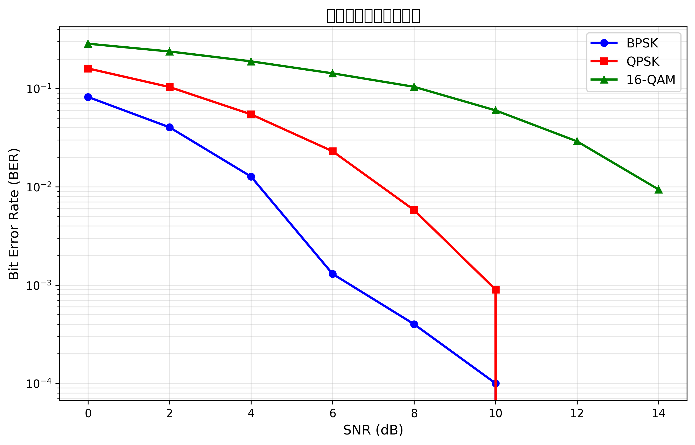

# 实验报告

⚠️ 注意：实验结果（代码与星座图）应在课堂或课后通过 GitHub 提交；实验报告可在截止日前逐步完善。

## 1. 实验目的

- 掌握数字调制方式 BPSK、QPSK、16-QAM 的实现与仿真方法。
- 能够进行基于 AWGN 信道的误比特率（BER）仿真，并绘制 BER vs SNR 曲线。
- 学会绘制并分析星座图，理解噪声对符号判决的影响。

## 2. 实验原理（简述 BPSK / QPSK / QAM 的调制原理）

- BPSK（双相移键控）：每个比特映射为两个相位之一（通常 0→+1，1→−1），符号位于实轴正负两点，判决只需比较实部符号的正负。

- QPSK（正交相位键控）：每两个比特映射为四个相位点（格雷编码常用），等幅且分别位于 I/Q 两轴上，常归一化为 (±1 ± j)/√2，判决可基于 I/Q 的符号或最小欧氏距离。

- 16-QAM（16 阶正交振幅调制）：4 比特映射为 16 个星座点，通常通过两路 4 水平电平（I/Q）组合实现，直观为 I/Q 取值 ∈ {±1, ±3}（格雷映射），并做归一化以控制平均能量。

## 3. 实验方法与步骤

1. 环境准备：安装依赖（NumPy、Matplotlib、SciPy、pytest、pylint 等）。
2. 实现调制函数：在 `src/modulation.py` 中实现 `bpsk_modulate`、`qpsk_modulate`、`qam16_modulate`，并生成星座图保存到 `results/`。
3. （选做）实现解调函数：在 `src/demodulation.py` 中实现 `bpsk_demodulate`、`qpsk_demodulate`、`qam16_demodulate`。
4. BER 仿真：在 `src/performance_test.py` 中实现仿真流程：生成随机比特 → 调制 → 添加 AWGN（`utils.add_awgn`）→ 解调 → 计算 BER（`utils.calculate_ber`），扫描 SNR 并保存 BER 曲线图。
5. 运行单元测试：使用 `pytest` 运行 `grading/` 中的测试用例并生成评分报告 `grade_report.json`。

## 4. 实验结果（插入星座图和 BER 曲线图片）

- BPSK 星座图：

  

- QPSK 星座图：

  

- 16-QAM 星座图：

  

- BER 性能图：

  

- 性能对比图（可选）：

  

> 说明：若图片未显示，请确保已运行 `src/performance_test.py` 及调制函数以生成 `results/` 下的对应图像，或通过 GitHub 提交并在查看器中打开。

## 5. 结果分析与讨论

- 星座图分析：随着 SNR 降低，星座点由理想位置向噪声扩散，判决错误增多；BPSK 的决策边界最简单（实部符号），QPSK 由 I/Q 两路共同决定，16-QAM 由于更密集的点位对噪声更敏感，BER 增长更快。

- 仿真 vs 理论：在高 SNR 区间仿真曲线趋近理论曲线；低 SNR 下受有限比特数与实现细节影响会有偏差。增加仿真比特数可获得更平滑、更接近理论的曲线。

- 实现注意事项：保证调制/解调映射一致（尤其是 Gray 映射），并对符号进行能量归一化（例如 QPSK 除以 √2，16-QAM 除以 √10）。

## 6. 实验心得与 GitHub Copilot 使用体会

- 实验心得：通过从比特到星座再到 BER 的完整流程，能直观理解调制度和信道噪声对通信性能的影响；实现与单元测试有助于验证每一步功能。

- GitHub Copilot 使用体会：Copilot 在生成样板代码（如映射表、循环、绘图函数）时很高效，可节省重复编码时间，但需要人工审查生成的数值细节（如归一化系数、位序/映射顺序）以确保与题目要求一致。

## 7. 参考文献

- Proakis, J. G., "Digital Communications".
- Sklar, B., "Digital Communications: Fundamentals and Applications".
- 教学资料与课程实验说明（请替换为具体课堂资料/讲义引用）。

---

文件：REPORT.md（位于项目根目录）。

建议下一步：将代码与 `results/` 下的图片一起提交到 GitHub（通过 `git add` / `git commit` / `git push`），以便教师评分时能看到完整结果。