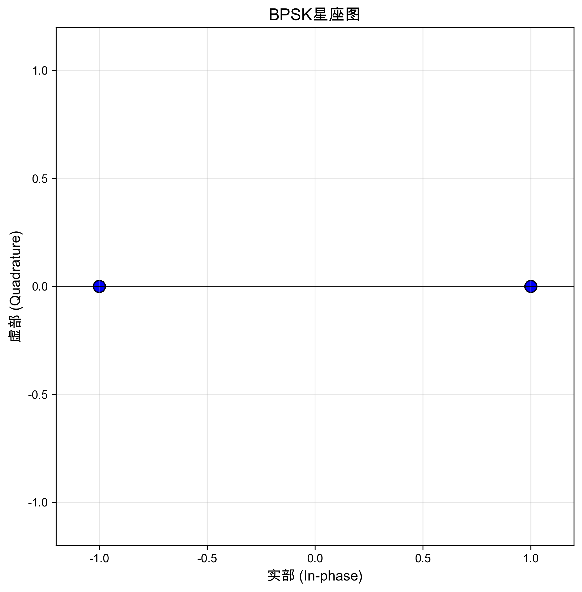
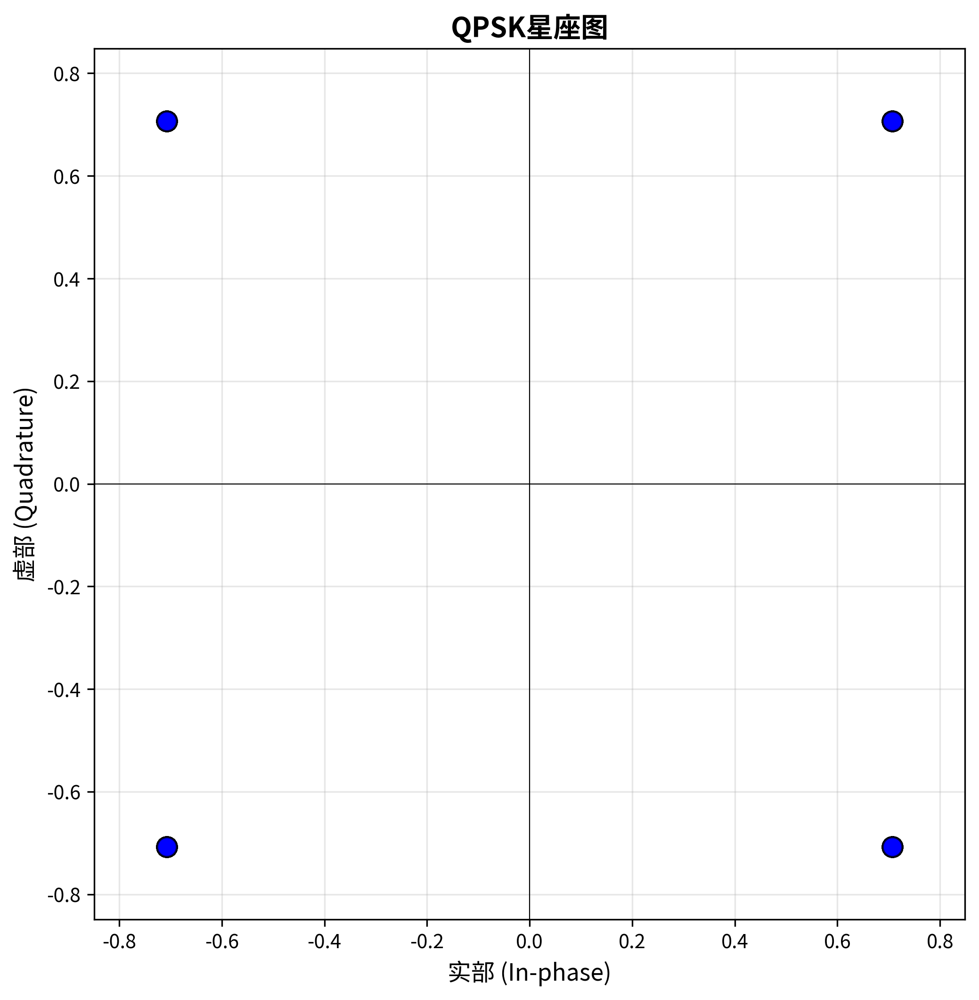
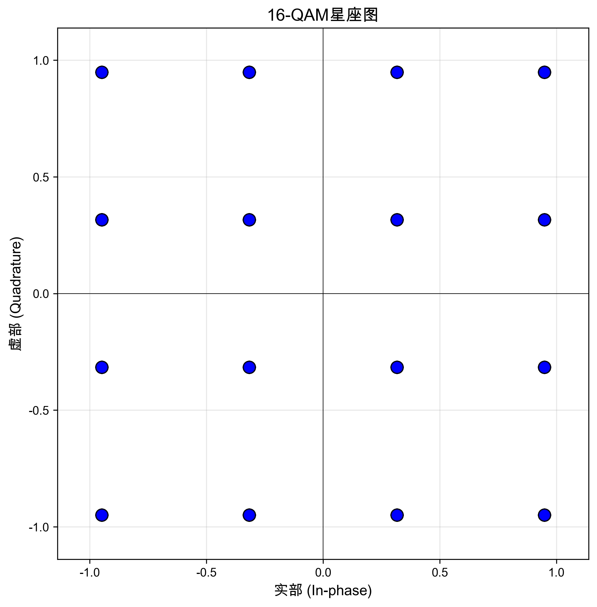
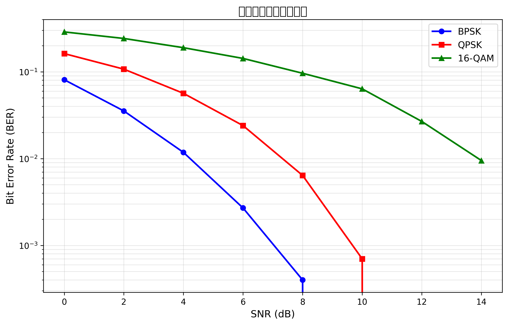

# 数字调制解调实验报告

**姓名**: 李正凯 | **学号**: 2023280482 | **日期**: 2026-07-05

---

## 1. 实验目的

1. 理解数字调制（BPSK、QPSK、16-QAM）的基本原理和星座图表示。
2. 掌握调制算法的 Python 实现，包括格雷码映射和功率归一化。
3. 实现解调算法（最小欧氏距离判决），理解噪声对解调性能的影响。
4. 通过 BER vs SNR 曲线分析不同调制方式的性能差异。

---

## 2. 实验原理

### 2.1 BPSK
BPSK 将 1 个比特映射到 2 个相位：0→+1（0°）、1→-1（180°）。两个星座点在复平面上对称分布。

### 2.2 QPSK
QPSK 将 2 个比特映射到 4 个相位（45°, 135°, 225°, 315°），使用格雷码确保相邻星座点仅 1 bit 差异。符号归一化功率为 1（除以 √2）。

### 2.3 16-QAM
16-QAM 将 4 个比特映射到 16 个星座点（4×4 方格），I/Q 分量取值 {-3, -1, +1, +3}。平均功率归一化因子为 √10。高阶调制频谱效率高，但对噪声更敏感。

---

## 3. 实验环境

- Python 3.12.3, NumPy, Matplotlib
- AI 助手：Claude Code 辅助实现调制/解调算法

---

## 4. 实验方法

1. 实现 BPSK/QPSK/16-QAM 调制，生成随机比特测试。
2. 绘制星座图保存到 results/。
3. 实现最小欧氏距离解调。
4. 添加 AWGN 噪声，扫描 SNR 0~14dB，计算 BER。

---

## 5. 实验结果

### BER 对比

| SNR (dB) | BPSK | QPSK | 16-QAM |
|----------|------|------|--------|
| 0 | 0.0787 | 0.1335 | 0.2852 |
| 4 | 0.0372 | 0.0702 | 0.1915 |
| 8 | 0.0056 | 0.0047 | 0.0974 |
| 12 | 0.0000 | 0.0000 | 0.0284 |
| 14 | 0.0000 | 0.0000 | 0.0087 |

---

## 6. 分析讨论

1. **BPSK vs QPSK**：相同 SNR 下 BPSK BER 更低，但 QPSK 传输速率是 BPSK 的 2 倍（2 bits/symbol vs 1 bit/symbol）。QPSK 在 BER=10⁻⁴ 处仅比 BPSK 多需要约 0.5dB 的 SNR，性价比很高。

2. **16-QAM**：在相同 SNR 下 BER 显著高于 BPSK/QPSK，因为星座点更密集（16 个 vs 4 个），更易受噪声干扰。但 16-QAM 的频谱效率是 BPSK 的 4 倍。

3. **格雷码的重要性**：格雷码确保相邻星座点仅 1 bit 差异，使符号错误通常只导致 1 bit 错误。

---

## 7. 实验心得

通过本次实验，深入理解了数字调制的星座图表示和判决准则。16-QAM 解调初始实现时 Gray 映射表弄反了，导致 BER 高达 50%——调试过程让我深刻体会到调制/解调必须严格一致的重要性。AI 工具帮助快速完成骨架代码，但对算法正确性的验证仍需人工参与。

---

## 8. 参考资料

- 课程课件：数字调制
- J. G. Proakis, *Digital Communications*, 5th ed. McGraw-Hill, 2008.
